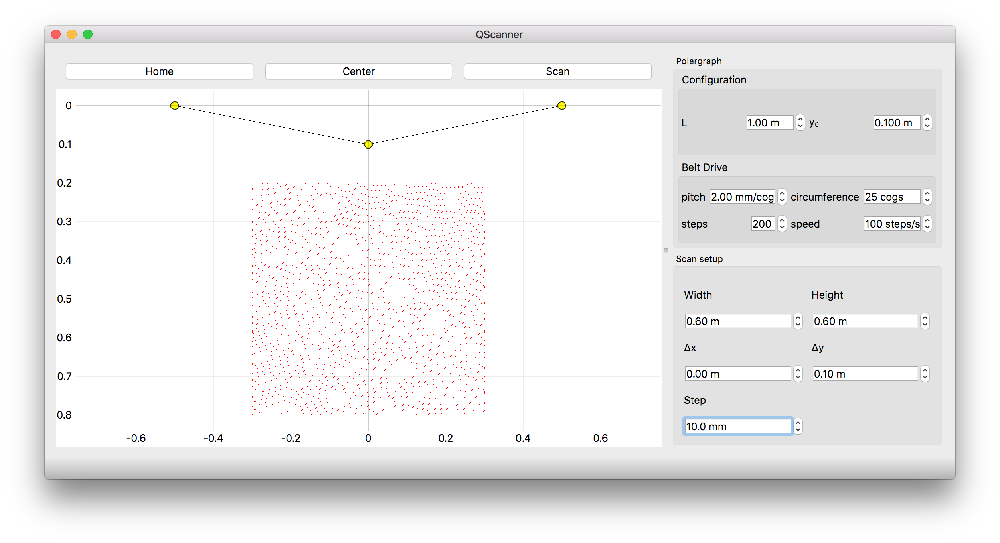

QPolargraph
===========

A Qt-based instrument interface for a two-dimensional polargraph scanner.
The scanner positions a payload anywhere within its scan area using two
stepper motors and a GT2 timing belt driven by an Arduino microcontroller.
Any Qt binding (PyQt5, PyQt6, PySide2, PySide6) is supported via ``qtpy``.

Built on `QInstrument <https://qinstrument.readthedocs.io>`_.

.. toctree::
   :maxdepth: 2
   :caption: Contents

   installation
   hardware
   quickstart
   api/index
   changelog
